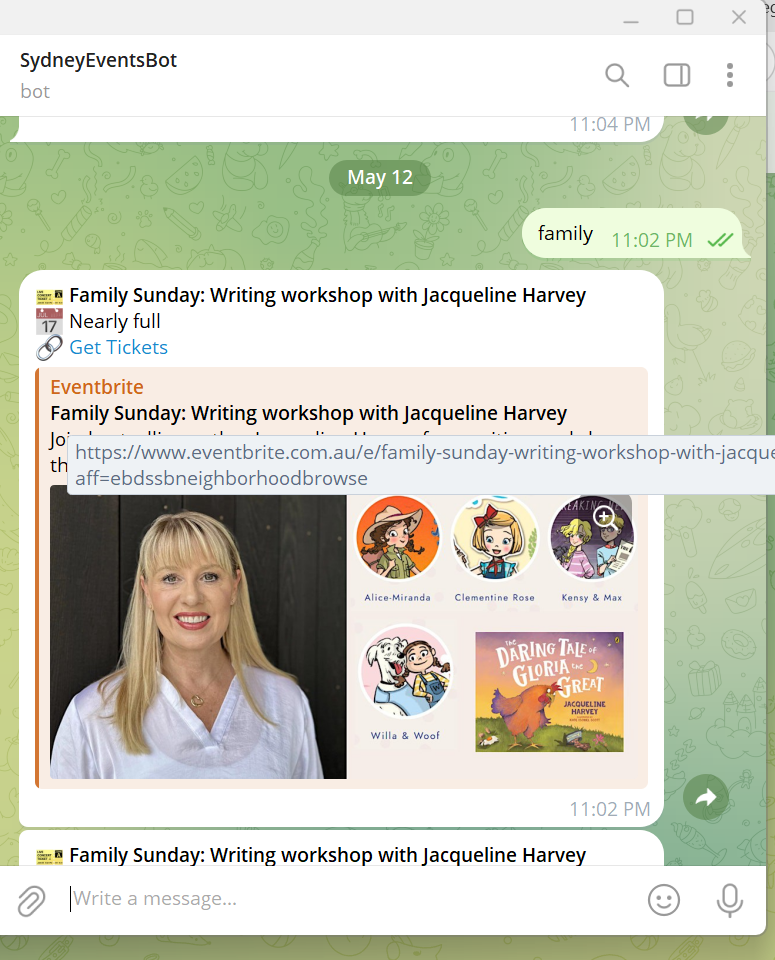

# 🗓️ Sydney Events Scraper

This is a Node.js web application that scrapes events happening in Sydney from the web and displays them on a web page.

## 🛠️ Features

- Scrapes live Sydney event data using Axios
- Stores data in MongoDB Atlas
- Displays events on a styled frontend using EJS
- Telegram bot integration

## 📦 Technologies Used

- Node.js
- Express.js
- Axios
- MongoDB Atlas
- EJS
- Telegram Bot API

## Prerequisites

- Node.js installed locally
- MongoDB Atlas cluster set up
- Telegram bot token

## Create a .env file:
MONGO_URI=your-mongodb-uri
BOT_TOKEN=your-telegram-bot-token

## run the app
node app.js

## 📸 Screenshots

##  Homepage

##  Email to get ticket

## Telegram Bot Response

##  Event Showing

## Hosted Project Link : https://sydney-events-app.onrender.com/ 

